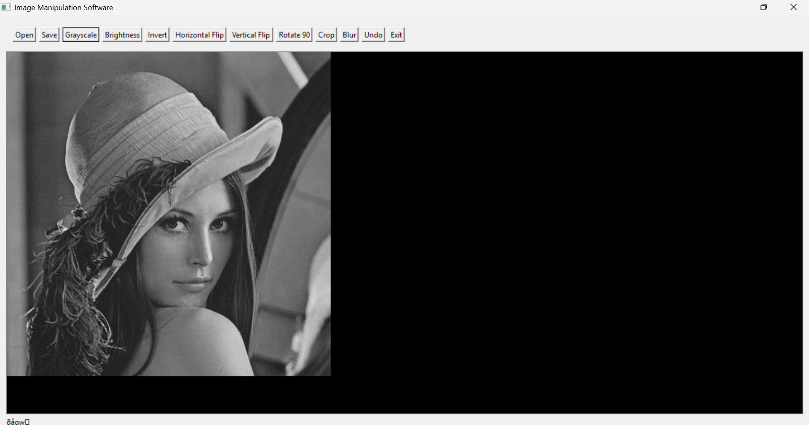
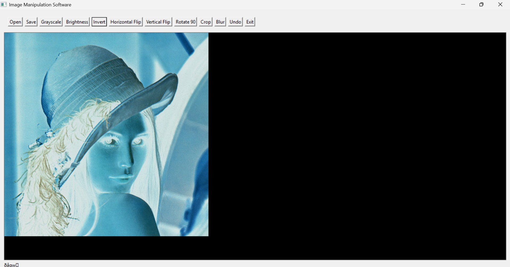
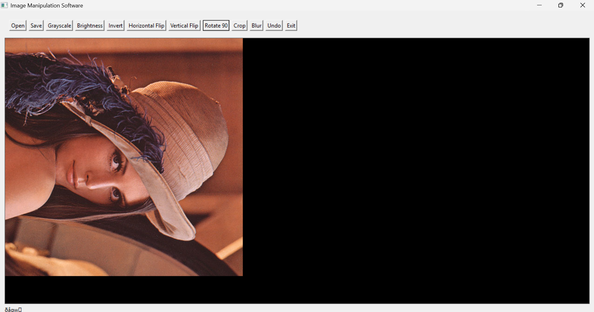
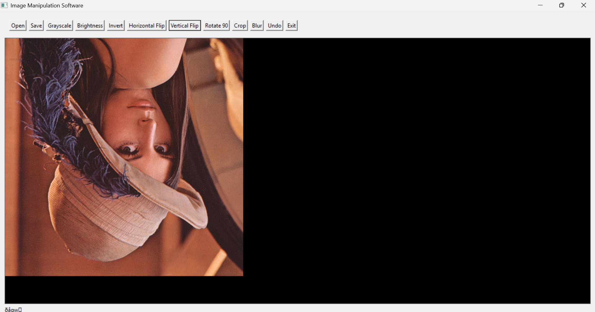
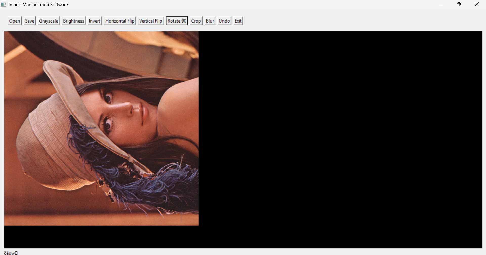
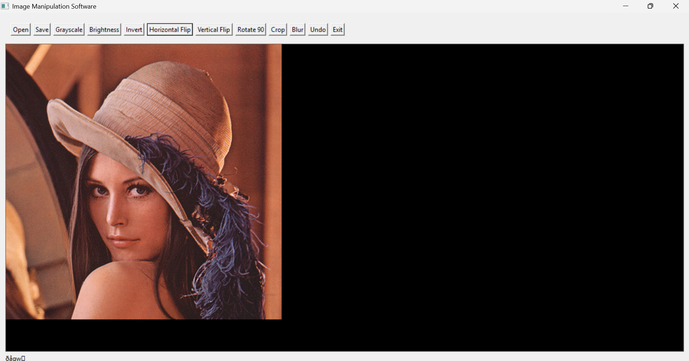
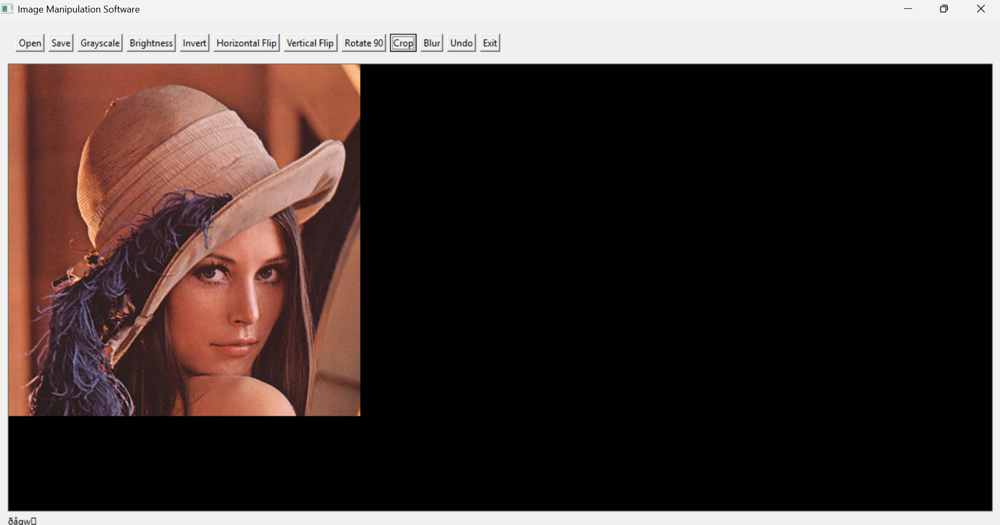
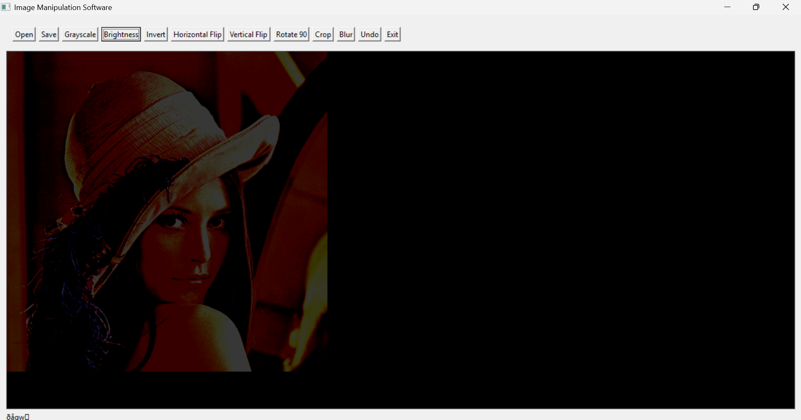
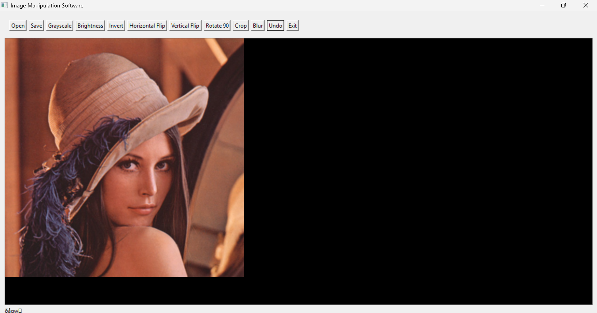

# 🖼️ Image Manipulation Software

A simple and user-friendly **Image Manipulation Software** with a graphical interface for performing common image-editing operations. The project demonstrates how image-processing features can be combined with a GUI to create a practical and easy-to-use application.

---

## ✨ Features

| Tool | Function |
|---|---|
| 📂 **Open** | Opens an image for editing. |
| 💾 **Save** | Saves the edited image. |
| ⚫ **Grayscale** | Converts a color image into grayscale. |
| ☀️ **Brightness** | Adjusts image brightness. |
| 🎨 **Invert** | Inverts the colors of the image. |
| ↔️ **Horizontal Flip** | Mirrors the image from left to right. |
| ↕️ **Vertical Flip** | Flips the image vertically. |
| 🔄 **Rotate 90** | Rotates the image by 90 degrees. |
| ✂️ **Crop** | Removes unwanted parts of an image. |
| 🌫️ **Blur** | Applies a blur effect to the image. |
| ↩️ **Undo** | Reverts the most recent modification. |
| ❌ **Exit** | Closes the application. |

---

## 🖥️ User Interface

The application provides a compact toolbar containing the major image-manipulation commands. The edited image is displayed directly in the application window.


---

## 📸 Screenshots & Demonstration

The following screenshots document the different image-processing operations and stages of the project.

### ⚫ Grayscale

The image is converted from its original colors into grayscale.



### ☀️ Brightness

The brightness operation changes the overall lightness of the image.


### 🎨 Invert

The invert operation produces a negative-style version of the image by reversing its colors.



### 🔄 Rotation

The rotation feature changes the orientation of the image. Multiple screenshots show different rotated states.







### ↪️ Additional Rotated State

Another rotated state of the image is shown below.



### ✂️ Cropping

The crop feature is used to focus on the required portion of an image by removing unwanted areas.



### 🖼️ Edited Image

The following screenshots show the image after further manipulation and previewing.






---

## 🚀 How to Use

1. Launch the **Image Manipulation Software**.
2. Click **Open** and select an image.
3. Choose an operation from the toolbar.
4. Check the result in the image display area.
5. Apply additional operations if needed.
6. Use **Undo** to reverse the latest change.
7. Click **Save** to save the edited image.
8. Click **Exit** when you are finished.

---

## 🔁 Basic Workflow

```text
        ┌──────────────┐
        │  Open Image  │
        └──────┬───────┘
               ↓
      ┌──────────────────┐
      │ Choose an Effect │
      └────────┬─────────┘
               ↓
       ┌───────────────┐
       │ Preview Image │
       └───────┬───────┘
               ↓
      ┌─────────────────┐
      │ More Editing ?  │
      └───────┬─────────┘
          Yes ↓   No → Save
             ↺
          Edit Again
```

---

## 🎯 Project Objective

The objective of this project is to develop a basic graphical image editor that demonstrates practical image-processing concepts. It provides commonly used editing operations through a simple interface and gives immediate visual feedback after applying an operation.

---

## 💡 Project Highlights

- Simple graphical user interface
- Multiple image-manipulation operations
- Direct visual preview of changes
- Undo support
- Easy-to-understand toolbar
- Practical application of image-processing concepts
- Suitable for an academic programming project

---

## 📁 Project Structure

```text
Image-Manipulation-Software/
│
├── screenshots/
│   ├── 01-grayscale.png
│   ├── 02-brightness.png
│   ├── 03-invert.png
│   ├── 04-rotate-90.png
│   ├── 05-rotate-180.png
│   ├── 06-rotate-270.png
│   ├── 07-rotated-image.png
│   ├── 08-crop.png
│   ├── 09-edited-image.png
│   ├── 10-final-preview.png
│   └── 11-final-result.png
│
├── README.md
└── main.c
```

> **Note:** If your C source file has a different name, simply replace `main.c` in the structure above with your actual filename.

---

## 🔮 Future Improvements

The project can be extended with additional features such as:

- Image resizing
- Contrast adjustment
- Sharpening
- Text and watermark tools
- Additional filters
- Better crop selection
- Multiple-level Undo/Redo
- Support for additional image formats
- Improved GUI design

---

## 🎓 Project Information

**Project:** Image Manipulation Software  
**Type:** GUI-based Image Processing Project  
**Purpose:** Educational / Academic Project

---

## 📄 License

This project is intended for educational purposes.

